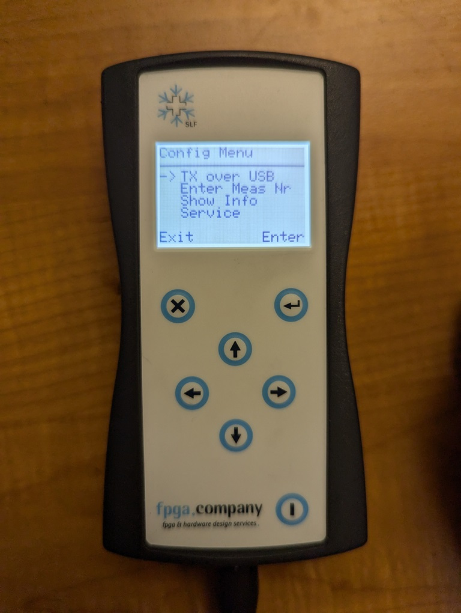
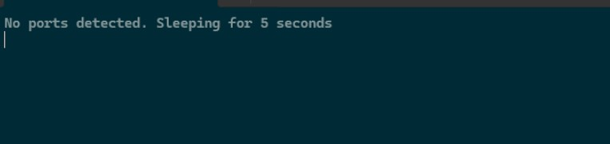
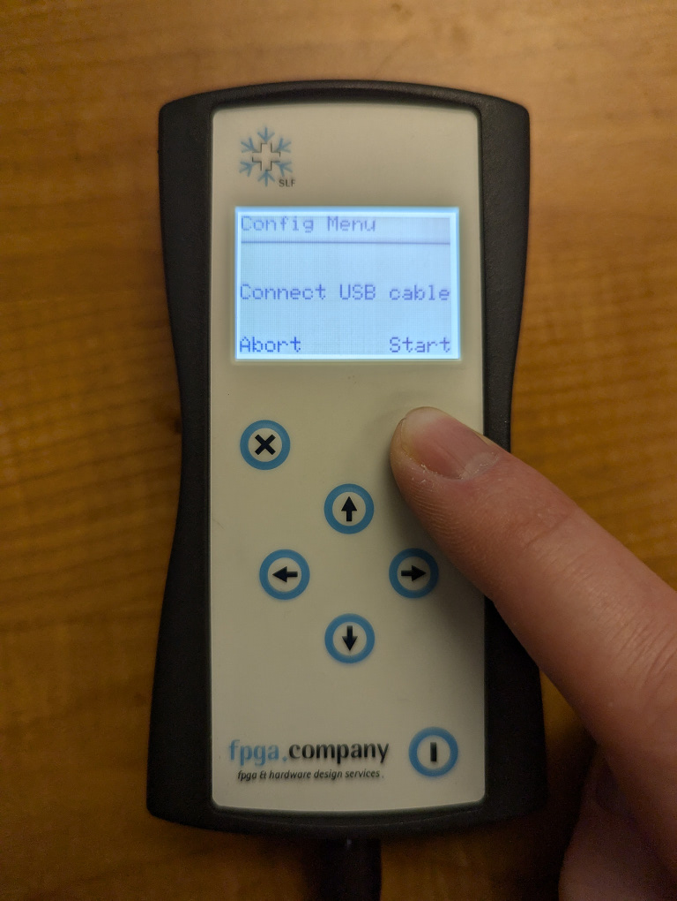
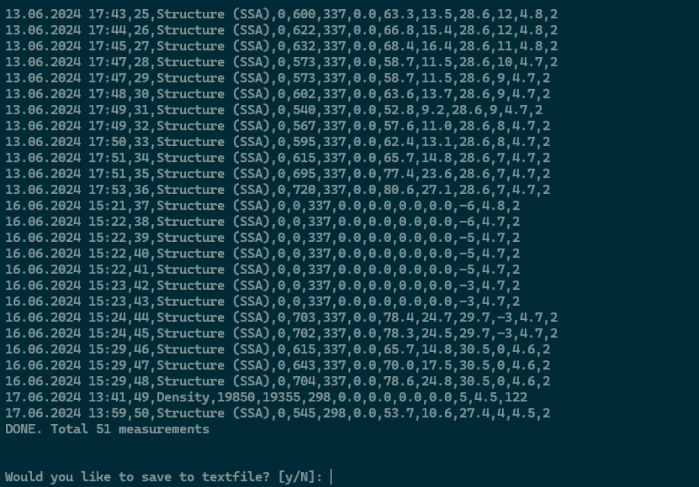

## Acquire software

Either download a prebuilt release for your platform from [Releases - m9brady/infrasnow-download](https://github.com/m9brady/infrasnow-download/releases) or download the Python source code from https://github.com/m9brady/infrasnow-download/ and install the required packages.

## Connect datalogger

Using the USB cable packaged with the InfraSnow sensor, connect the logger to your computer and power the logger on. Navigate to the `Configuration` menu on the logger, select `TX over USB` (see below) and push the `Enter` button. This will create the serial connection between the logger and your computer.



## Download measurements

If you downloaded a prebuilt release, start it and wait for a console window to appear:



If you downloaded the Python source code, run the code with

```python
python infrasnow_downloader.py
```

The same message as in the above image will appear.

There are 3 scenarios that may happen next:

1. If you see `No ports detected. Sleeping for 5 seconds` despite the logger being plugged in and `TX over USB` selected, try restarting the logger and repeating the [Connect datalogger](#connect-datalogger) sequence. If nothing changes, it is likely a USB driver issue with your computer.

2. If you see `Connection established with COM device` then you are ready to proceed.

3. If you see a numbered list of available COM ports and you know which device is the logger (usually `USB Serial Device`), enter the number of the device in the list and you should see `Connection established with COM device` and can proceed.

On the logger, push the `Start` button and observe the console on your computer. You should see a printout of the measurements followed by a prompt asking if you'd like to save the measurements to a text file.





Verify that the measurements shown in the console, and save the results if needed. 

> [!NOTE]
> This tool does not delete any measurements from the logger device! It is up to the user to verify that the measurements are safely downloaded before clearing the logger's memory manually.
